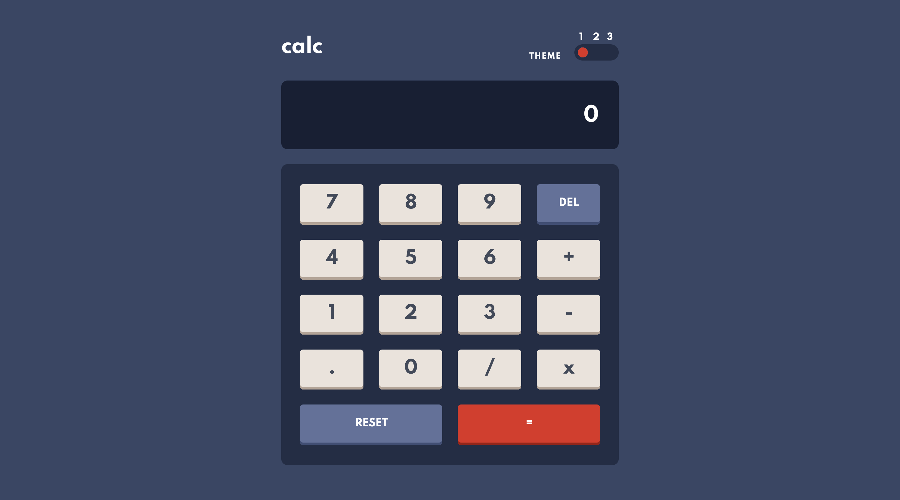

# Frontend Mentor - Calculator app solution

This is a solution to the [Calculator app challenge on Frontend Mentor](https://www.frontendmentor.io/challenges/calculator-app-9lteq5N29). Frontend Mentor challenges help you improve your coding skills by building realistic projects.

## Table of contents

- [Overview](#overview)
  - [The challenge](#the-challenge)
  - [Screenshot](#screenshot)
  - [Links](#links)
- [My process](#my-process)
  - [Built with](#built-with)
  - [What I learned](#what-i-learned)
  - [Continued development](#continued-development)
  - [Useful resources](#useful-resources)
- [Author](#author)

## Overview

### The challenge

Users should be able to:

- See the size of the elements adjust based on their device's screen size
- Perform mathmatical operations like addition, subtraction, multiplication, and division
- Adjust the color theme based on their preference
- **Bonus**: Have their initial theme preference checked using `prefers-color-scheme` and have any additional changes saved in the browser

### Screenshot

### Links

- Live Site URL: [Vercel](https://calculator-app-hub.vercel.app)

## My process

### Built with

- Mobile-first workflow
- [React](https://reactjs.org/) - JS library
- [Next.js](https://nextjs.org/) - React framework
- [TailwindCSS](https://tailwindcss.com) - For CSS
- [HeadlessUI](https://headlessui.dev) - For Headless UI Components

### What I learned

I have learned how to switching themes and creating a working calculator following iOS calculator app. Even though it is easy when first thought about calculator but if deep deeper there is a lot of hidden logic that is not known.

There is some codes in here that I am proud of because it is my first time and I am managed to done it.

Lists:

- `./components/MultipleToggleSwitch.tsx` (Three way toggle)
- `./styles/globals.css` & `./tailwind.config.js` (Theme switching)

### Continued development

I would like to seperate more repetitive file into more smaller parts and tried out to call API because in this project there is no API to be called.

### Useful resources

- [Tailwind Theme Switcher](https://github.com/huphtur/tailwind-theme-switcher) - I am not experienced with theme switching before this but with this example I managed to figure out the way by looking through the source code.

## Author

- Frontend Mentor - [@rezuankassim](https://www.frontendmentor.io/profile/rezuankassim)
- Twitter - [@KassimRezuan](https://twitter.com/KassimRezuan)
- LinkedIn - [rezuan-kassim](https://www.linkedin.com/in/rezuan-kassim/)
